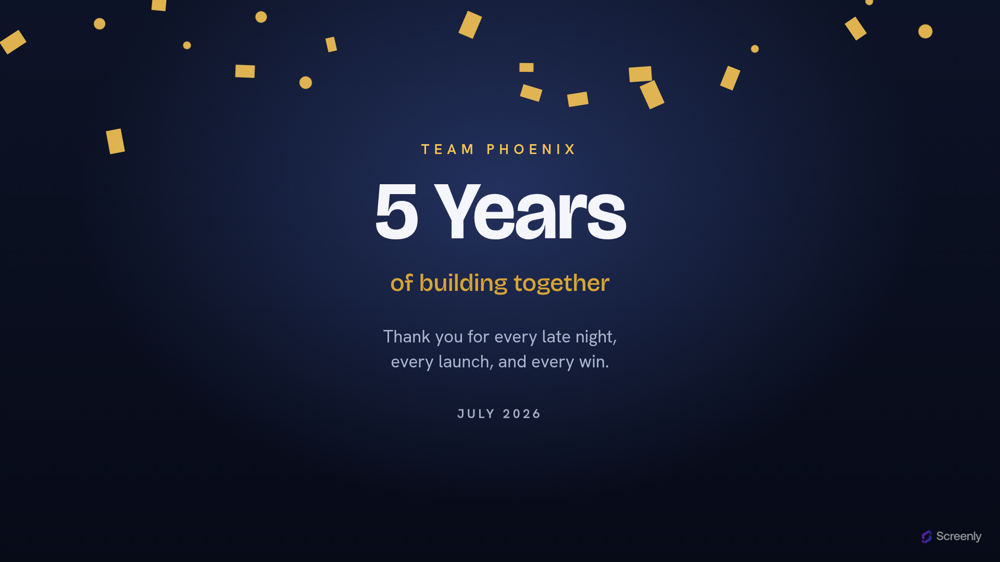

# Screenly Team Milestone App

A full-screen team-milestone celebration for digital signage. It puts a named
team's win front and centre — a big value like **5 Years**, **1,000,000 Users**,
or **Project Shipped** — set in a bold Bricolage Grotesque display face over a
deep midnight ground lit by a warm gold burst, with an optional caption, a
message, and a date, all under a shower of confetti.



Live: **https://team-milestone.srly.io**

Part of the Screenly signage family alongside the [quotes](../quotes),
[opening-hours](../opening-hours) and [birthday](../birthday) apps. Like Quotes,
this is a fully **static** site hosted on **GitHub Pages** — there's no server.
Like Opening Hours it takes **settings**: the milestone arrives entirely in the
launch URL's query string, so one deployment celebrates any team.

## How it's configured

Everything is passed as query parameters — one milestone per screen:

```
https://team-milestone.srly.io/?team=Team+Phoenix&value=5+Years
  &label=of+building+together&message=Thank+you+for+every+win.&date=July+2026
```

| Param | Meaning |
| --- | --- |
| `value` | The headline milestone, e.g. `5 Years`, `1,000,000 Users`, `Project Shipped`. Omitted, it falls back to a neutral *Milestone*. |
| `team` | Optional team name shown above the value, e.g. `Team Phoenix`. |
| `label` | Optional caption under the value, e.g. `of building together`. |
| `message` | Optional supporting sentence, e.g. a thank-you. |
| `date` | Optional dateline, e.g. `July 2026`. |

Opened with no parameters (e.g. the store preview), it shows a worked example so
the screen is never blank. There's no rotation and no data to refresh — it's a
single celebratory page the player reloads on its own schedule.

## Resolutions

Designed to look correct full-screen at common signage resolutions, both
orientations. One fluid root font-size (`clamp(vw + vh)`) drives the whole scale,
so there are no breakpoints.

| Resolution | Orientation |
| --- | --- |
| 1920×1080 | Landscape |
| 1080×1920 | Portrait |
| 3840×2160 | Landscape (4K) |
| 800×480 | Landscape (Raspberry Pi touch display) |

The confetti falls only when the viewer hasn't asked to reduce motion; with
`prefers-reduced-motion: reduce` it stills and the milestone stands on its own.

## Development

Requires [Bun](https://bun.sh). Never npm/npx.

```sh
bun install     # deps; vendored fonts come from @fontsource via sync-fonts
bun run dev     # build + serve dist/ locally
bun run build   # assemble dist/ for GitHub Pages
bun test        # bun:test — helpers + manifest validation
bun run typecheck
bun run lint
```

## How it's built

`build.js` assembles `dist/` without mutating sources: vendor fonts → copy
`index.html` + static assets + `.well-known` → compile & minify Tailwind → bundle
& minify the TypeScript → stamp a sha256 content hash into `?v=` asset URLs →
write `CNAME` (`team-milestone.srly.io`). `dist/` is gitignored and is the
artifact GitHub Pages publishes.

Push to **`master`** and `.github/workflows/deploy-pages.yml` builds and deploys
to Pages. Pull requests run `ci.yml` (typecheck + lint + test + build). Action
versions are SHA-pinned.

## Licence

[AGPL-3.0-only](LICENSE).
